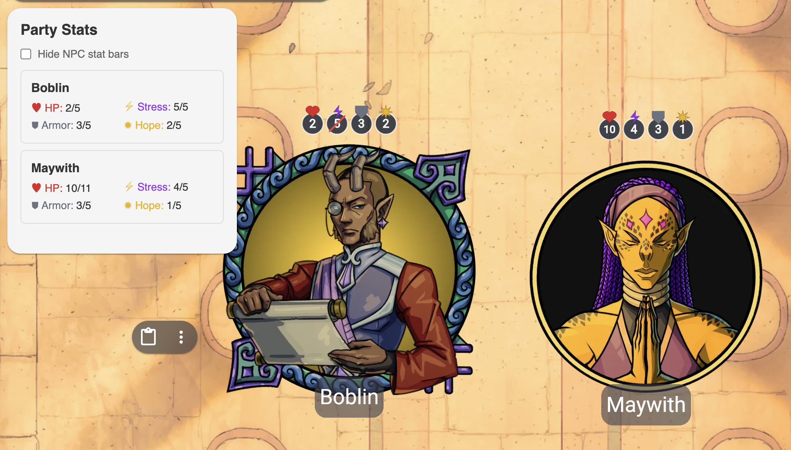
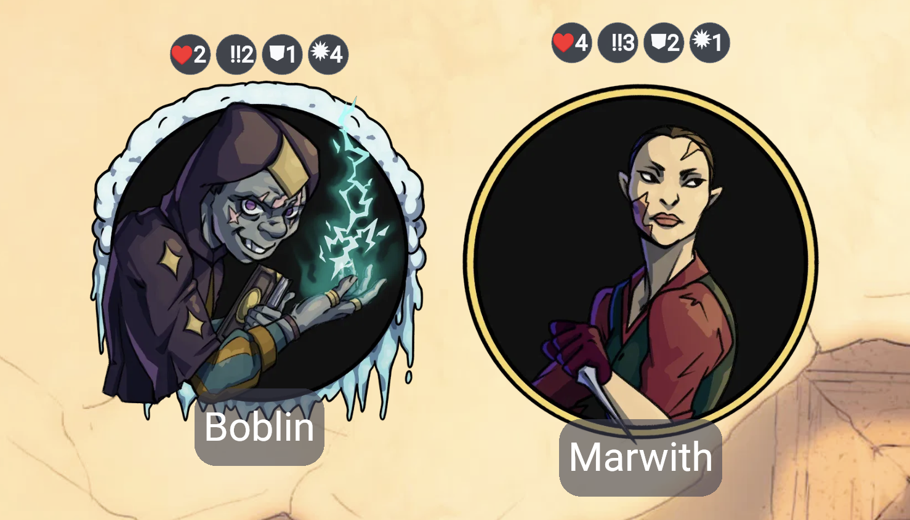
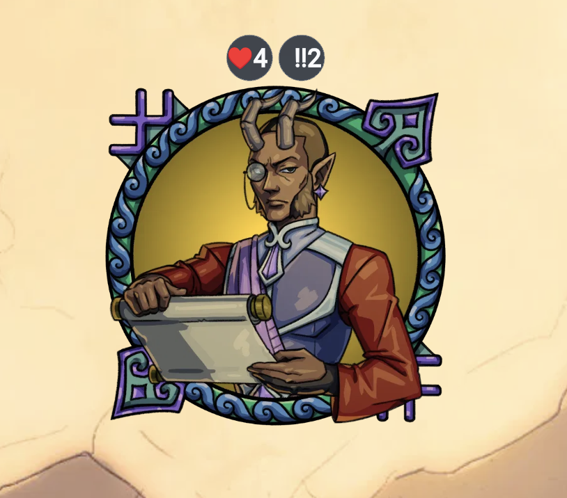
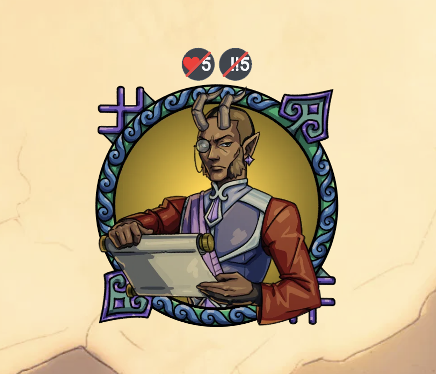
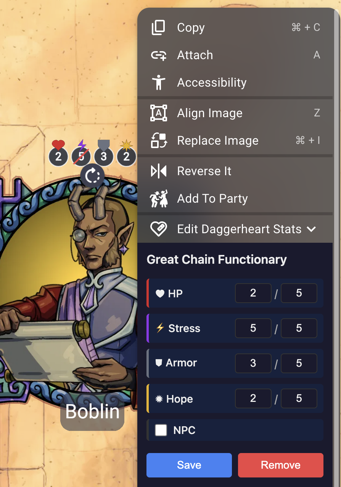

# Daggerheart Stats Tracker for Owlbear Rodeo

A free [Owlbear Rodeo](https://www.owlbear.rodeo) extension for tracking Daggerheart RPG character stats. Compact circular badges render above each token showing HP, Stress, Armor, and Hope — with stat glyphs, critical state indicators, and cross-scene persistence.



## Features

- **Circular Stat Badges**: Compact badges above tokens display current values with colored vector glyphs (♥ HP, ⚡ Stress, ⛊ Armor, ✹ Hope)
- **Critical State Indicators**: A red slash overlay appears when a stat reaches its critical state (HP/Stress/Armor at max, Hope at zero)
- **Proportional Scaling**: Badges scale with token size so they stay readable at any zoom level
- **Cross-Scene Persistence**: Stats survive scene changes within the same room
- **Party Stats Dashboard**: View all PC stats at a glance from the toolbar
- **PC & NPC Modes**: PCs track all four stats; NPCs show only HP and Stress

  | PC (all 4 stats) | NPC (HP & Stress only) | NPC with critical state |
  |:-:|:-:|:-:|
  |  |  |  |
- **Math Expressions**: Type `+2` or `-3` in a stat field to apply deltas quickly
- **Multiplayer**: All players see badges; any player can add/edit stats on their tokens

## Installation

1. Go to [owlbear.rodeo](https://www.owlbear.rodeo) and sign in
2. Click your **profile icon** (top right) → **Extensions** → **Add Extension**
3. Paste the manifest URL:
   ```
   https://arrowedisgaming.github.io/Daggerheart-Stats-Tracker-for-OBR/manifest.json
   ```
4. Click **Add**

## How to Use

### Adding Stats to a Token

1. Open or create a room and add CHARACTER tokens to the scene
2. Right-click a token → **Add Daggerheart Stats**
3. Set HP, Stress, Armor, and Hope values
4. Circular badges appear above the token automatically

### Editing Stats

Right-click a tracked token → **Edit Daggerheart Stats** to open the stat editor. Adjust values directly, or type math expressions like `+2` or `-1` and press Enter. Toggle between PC and NPC mode as needed.



### Party Stats Dashboard

Click the **Daggerheart Stats Tracker** icon in the toolbar to open the dashboard. It shows a live summary of all PC stats in the current scene — auto-updates when stats change.

### GM Settings

- **Hide NPC stat bars**: GMs can toggle this to hide NPC badges from the scene entirely. NPC stats remain editable via the context menu.

## Stats Reference

| Stat   | Glyph | Color  | Default (PC) | Default (NPC) |
| ------ | ----- | ------ | ------------- | -------------- |
| HP     | ♥     | Red    | 6/6           | 6/6            |
| Stress | ⚡     | Purple | 0/6           | 0/6            |
| Armor  | ⛊     | Gray   | 0/6           | Hidden (0/0)   |
| Hope   | ✹     | Gold   | 2/5           | Hidden (0/0)   |

## How It Works

Stats are stored in Owlbear Rodeo room metadata, so they persist across scene changes within the same room. Each token is identified by a stable UUID — renaming or copying tokens won't break their stats.

Badges are rendered as OBR Shape items attached to tokens. Only the GM client creates/deletes badge shapes to prevent race conditions in multiplayer sessions.

## Changelog

See [CHANGELOG.md](CHANGELOG.md) for the full version history.

## Contributing

Want to develop or deploy your own version? See [DEPLOYMENT.md](DEPLOYMENT.md) for local development setup, building, and GitHub Pages deployment instructions.

## License

Based on [Owl Trackers](https://github.com/SeamusFinlayson/owl-trackers) by Seamus Finlayson, licensed under GNU GPLv3.

Modified for Daggerheart by Arrowed.

This project is licensed under GNU GPLv3.
